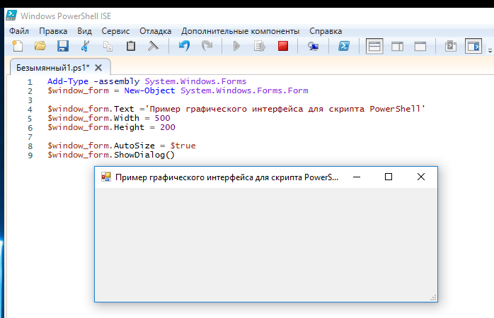
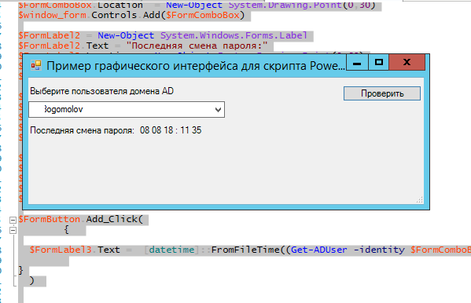

## Introduction

This document gives the basic recommendations on how to use 
the PowerShell to Interact with the Windows API.

**What can I do compiling C# code with PowerShell?**

This Interaction with the Windows API using PowerShell enables accomplish low-level tasks. For example, [creating a message box](#How_to_create_a_message_box).

See [Windows API index](https://docs.microsoft.com/en-us/windows/win32/apiindex/windows-api-list#windows-environment-shell) to learn more about WinAPI.

**Before you start**

To get started in Interaction PowerShell with the Windows API:

1. Install PowerShell.
2. Learning PowerShell.
3. Install application for Windows PowerShell — *The Windows PowerShell Integrated Scripting Environment (ISE)*.

**Note also**, Windows powershell works with objects, unlike the command line, which works with text.

For more information about, see: [official product documentation for PowerShell](https://docs.microsoft.com/en-gb/powershell/)

## Getting started

В этой инструкции сначала вы запустите скрипт в приложении Windows PowerShell ISE, затем
выполните функцию Windows API *MapFileAndCheckSumA* с помощью PowerShell.

Перед началом работы напишите скрипт.

### Запустите приложение PowerShell ISE

В меню «Выполнить» (WinKey + R) введите команду `PowerShell ISE`.

### Проверьте текущие параметры политики запуска скриптов

Введите команду `Get-ExecutionPolicy`. 

В результате вы получите одно из значений. Полученное значение будет соответствовать той или иной настройки:

* Restricted (значение по умолчанию) — выполнение скриптов запрещено.
* AllSigned — выполнение скриптов, подписанных доверенным разработчиком.
* RemoteSigned — выполнение собственных скриптов и тех, что подписаны доверенным разработчиком.
* Unrestricted — выполнение любых скриптов.

### Измените настройку политики запуска на *RemoteSigned* 

Введите команду `Set-ExecutionPolicy`: 

`PC C: \User\I.Scur> Set-ExecutionPolicy RemoteSigned`

В результате вы сможете запускать собственные скрипты и те, что подписаны доверенным разработчиком.

### Запустите написанный ранее скрипт

Кликните правой кнопкой мыши по файлу с расширением .ps1 с сохраненным скриптом и выберите «Запустить в PowerShell».

### Выполните функцию Windows API MapFileAndCheckSumA

Подробнее о функции *MapFileAndCheckSumA* читайте [официальную документацию](https://docs.microsoft.com/en-us/windows/win32/api/imagehlp/nf-imagehlp-mapfileandchecksuma).

Выполните командлет PowerShell **Add-Type**, чтобы скомпилировать C# код для функции *MapFileAndCheckSumA*:

```
Add-Type -TypeDefinition @"
using System;
using System.Diagnostics;
using System.Runtime.InteropServices;

public static class Imagehlp
{
[DllImport("imagehlp.dll", CharSet=CharSet.Auto)]
public static extern bool MapFileAndCheckSumA(
[MarshalAs(UnmanagedType.LPStr)] string Filename,
UIntPtr HeaderSum,
UIntPtr CheckSum);
}
"@

$x = [UIntPtr]::new(5)
$y = [UIntPtr]::new(5)
[Imagehlp]::MapFileAndCheckSumA("C:\Program Files\Internet Explorer\iexplore.exe", $x,$y)
```

См. также [Advanced operations](#Advanced_operations)

## Advanced operations

In this section step-by-step

* [How to create a message box](#How_to_create_a_message_box)
* 

### How to create a message box

Before creating with PowerShell a message box check out [the structure definition](https://docs.microsoft.com/en-us/windows/win32/api/winuser/nf-winuser-messagebox).
These definitions can be compiled with PowerShell commands and scripts.

In this case, the message box structure is used:

```C++
int MessageBox(
[in, optional] HWND    hWnd,
[in, optional] LPCTSTR lpText,
[in, optional] LPCTSTR lpCaption,
[in]           UINT    uType
);
```

To create a window using PowerShell:

1. Load the class `System.Windows.Forms` into the PowerShell session:

   `Add-Type -assembly System.Windows.Forms`

2. Create the window form:

   `$window_form = New-Object System.Windows.Forms.Form`

3. Set the title and dimensions of the window form (in pixels):

```
$window_form.Text ='Пример графического интерфейса для скрипта PowerShell'
$window_form.Width = 500
$window_form.Height = 200
```

4. Enable the AutoSize attribute, so that the window form automatically stretches:

`$window_form.AutoSize = $true`

5. Display the window form:

`$window_form.ShowDialog()`

| |
|---|
|The window form |

On the screen appeared an empty shape of the window form. 

6. Add various graphical dialog elements to shape. Before the `$window_form line.ShowDialog()` add the following lines:

```
$FormLabel1 = New-Object System.Windows.Forms.Label
$FormLabel1.Text = "Выберите пользователя домена AD"
$FormLabel1.Location = New-Object System.Drawing.Point(0,10)
$FormLabel1.AutoSize = $true
$window_form.Controls.Add($FormLabel1)
```
```
$FormLabel2 = New-Object System.Windows.Forms.Label
$FormLabel2.Text = "Последняя смена пароля:"
$FormLabel2.Location = New-Object System.Drawing.Point(0,40)
$FormLabel2.AutoSize = $true
$window_form.Controls.Add($FormLabel2)
$FormLabel3 = New-Object System.Windows.Forms.Label
$FormLabel3.Text = ""
$FormLabel3.Location = New-Object System.Drawing.Point(140,60)
$FormLabel3.AutoSize = $true
$window_form.Controls.Add($FormLabel3)
```

On the window form appeared titles.

7. Add an action button «Проверить» to the form:

```
$FormButton = New-Object System.Windows.Forms.Button
$FormButton.Location = New-Object System.Drawing.Size(400,10)
$FormButton.Size = New-Object System.Drawing.Size(100,20)
$FormButton.Text = "Проверить"
$window_form.Controls.Add($FormButton)
```

8. Create a drop-down list and fill it with a list of accounts from the domain obtained using the Get-ADUser cmdlet:

```
$FormComboBox = New-Object System.Windows.Forms.ComboBox
$FormComboBox.Width = 250
$Users = get-aduser -filter * -Properties SamAccountName
Foreach ($User in $Users)
{
$FormComboBox.Items.Add($User.SamAccountName);
}
$FormComboBox.Location = New-Object System.Drawing.Point(60,10)
$window_form.Controls.Add($FormComboBox)
```

9. Add the verification script to call the button clicking (Add_Click event). To convert a date from TimeStamp format to a normal view, use the `[datetime]::FromFileTime function`.

```
$FormButton.Add_Click(
{
$FormLabel3.Text = [datetime]::FromFileTime((Get-ADUser -identity $FormComboBox.selectedItem -Properties pwdLastSet).pwdLastSet).ToString('dd mm yy : hh ss')
}
)
```

9. Run the PowerShell script

 * The script fills the drop-down list with account names from AD
 * The script displays the time of the last password change of the user in Active Directory

| |
|---|
|The result of the script|

## Practical guidelines

In this section three methods of PowerShell that calls the Windows API function (methods of compiling C# code)

* [*Add-type cmdlt* method](#_Add-type_cmdlt_method)
* [Dynamic method (Metaprogramming)](#_Dynamic_method_(Metaprogramming))
* [Non-public method](#_Non-public_method)

### Add-type cmdlt method


### Dynamic method (Metaprogramming)


### Non-public method


## Concepts

### Metaprogramming

Use Metaprogramming to:

For more information about, see:

### .NET classes

Use .NET classes to:

For more information about, see:

## FAQ

>How do I do some operations in the case as quickly as possible?

Command-lets (cmdlets) is very useful for a quick session. 
Cmdlets are PowerShell commands based on .NET class. 
You can use any compiled .NET or dynamically typed scripting language 
to run any action on your system.  

For example, *add-type* cmdlets can de used, 
if you suddenly need
some functions of .NET languages that are not available in PowerShell.

The one of the add-type cmdlets is a *calling the Win32API Show-WindowAsync function*:

```
$type = Add-Type @"

[DllImport("user32.dll")]

public static extern bool ShowWindowAsync(IntPtr hWnd, int nCmdShow);

"@ -name "Win32ShowWindowAsync" -namespace Win32Functions -passthru

#Hides the PowerShell window

$type::ShowWindowAsync((get-process -id $pid).MainWindowHandle,2)

#Shows the window again

$type::ShowWindowAsync((get-process -id $pid).MainWindowHandle,10)
```

**Note also**, cmdlets use Verb-Noun name pair:

* Add-Computer;
* Remove-Computer;
* Reset-ComputerMachinePassword;
* Test-ComputerSecureChannel.

Most of the features of the utility net.exe can be replaced by the cmdlets.

For more information about cmdlets, enter:

```
Get-Command //
```

```
Get-Help Get-Command //
```

```
Get-Help Get-Command -Examples //
```